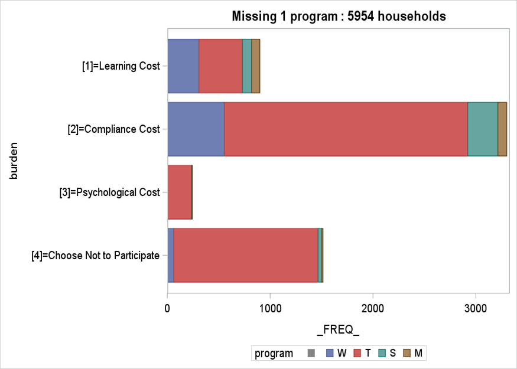
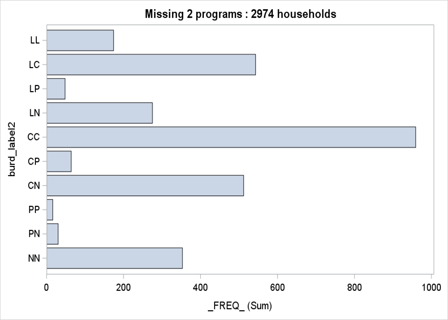
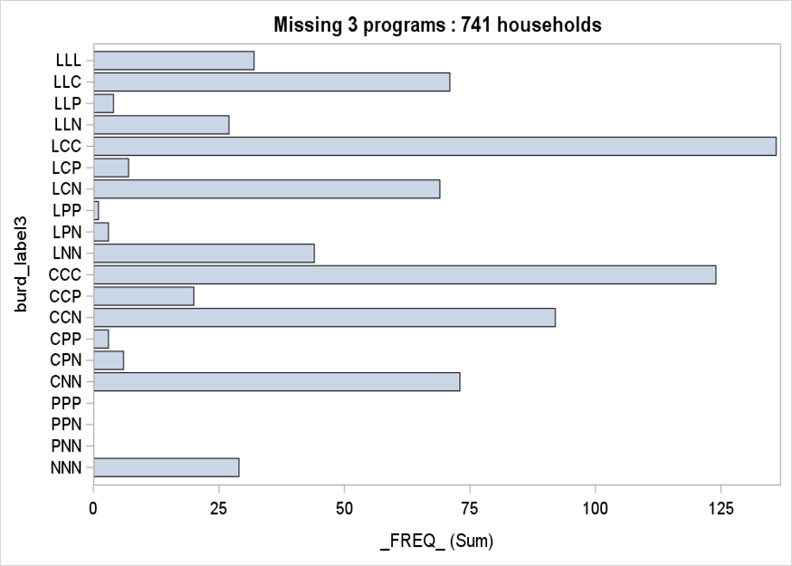
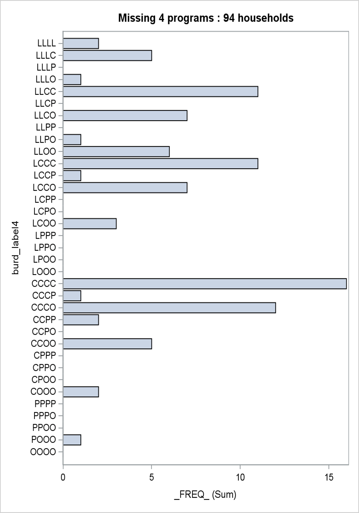

# Enrollment-burden-visualizations
About:

The project created vizualizations to determine burden of households on the enrollment of certain programs. There are 4 programs that participants an enroll in based on their eligibilty. We recorded the reasons for not them not participating in the program it could be either due to Compliance cost (C), Psychological cost (P), Learning cost (L) or Choose not to participate (O). We summarized these reasons as burdens for lack of enrollment. Later, we calculated frequencies of participants not enrolled in either 1, 2, 3 or 4 programs. Next, we calculated the permutations for the combination of these 4 burdens in 2(“LL”, “LC”,”LP”,”LN”, “CC”, “CP”, “CN”, “PP”, “PN”, “NN”) , 3  (“LLL”,”LLC”,”LLP”,”LLN”, “LCC”, “LCP”…)and 4  (“LLLL”, “LLLC”, “LLLP”, “LLLN”, “LLCC”…..). Using these permutations and combinations we produced visualitzations for the administrative burdens of each program.

Programming language used : SAS 9.4

## Plot 1: 1 Program burden

## Plot 2: 2 Program burden

## Plot 3: 3 Program burden

## Plot 4: 4 Program burden

